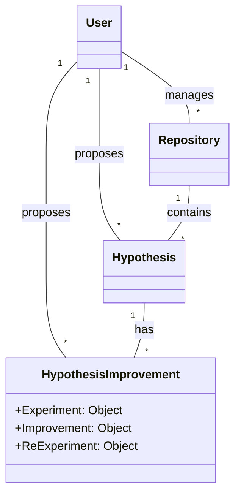
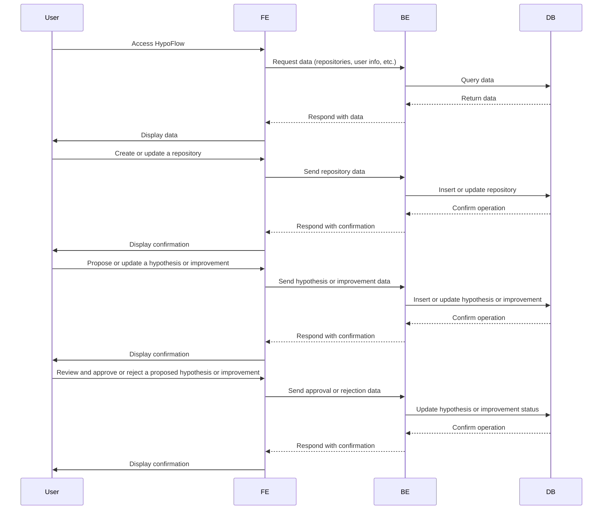

# HypoFlow DesignDoc: 要件定義
## プロジェクト概要
HypoFlowは、研究者が手軽に共同研究を行うためのWebアプリケーションです。研究課題のレポジトリごとにバックログを仮説の形で積み上げ、実証結果やデータ、仮説の改善点、再実験の結果などを共有・議論できるプラットフォームを提供します。

## 機能要件
- **認証・認可**:ユーザーはアカウントを作成し、ログインしてHypoFlowを利用できる。また、管理者として特定の操作を実行できる。
- **研究課題レポジトリの作成・管理**:ユーザーは研究課題のレポジトリを作成し、タイトル、説明、タグ、関連資料などを登録・編集できる。
- **仮説の提案・管理**:ユーザーは研究課題に対して仮説を提案し、その詳細や関連資料を追加できる。また、提案された仮説を編集・削除することができる。
- **実証結果・データの提案・管理**:ユーザーは仮説に対する実証結果やデータを提案し、その詳細や関連資料を追加できる。また、提案された実証結果やデータを編集・削除することができる。
- **仮説の改善点・再実験の結果の提案・管理**:ユーザーは仮説の改善点や再実験の結果を提案し、その詳細や関連資料を追加できる。また、提案された改善点や再実験の結果を編集・削除することができる。
- **レビュー・承認**:提案された仮説、実証結果、データ、改善点、再実験の結果に対して、レポジトリの管理者はレビューを行い、承認または却下を決定できる。承認された提案は、レポジトリに反映される。
- **コントリビューションの追跡**:承認された提案に対して、提案者にコントリビューションが与えられる。ユーザーは自分のコントリビューション履歴を確認できる。
- **研究課題レポジトリの検索・閲覧**:ユーザーは研究課題レポジトリをキーワードやタグで検索し、閲覧することができる。
- **ユーザープロフィール**:ユーザーは自分のプロフィールページを作成・編集し、自分の研究に関する情報やコントリビューション履歴を公開できる。
- **アクティビティフィード**:ユーザーはフォローしているレポジトリやユーザーのアクティビティをフィード形式で確認できる。
- **通知**:ユーザーは自分に関連するアクション（提案の承認・却下、フォローなど）について通知を受け取ることができる。

3. 技術要件
- フロントエンド: React.jsを使用して、モダンで使いやすいインターフェースを実装する。
- バックエンド: Node.jsを使用して、効率的でスケーラブルなAPIを実装する。
- データベース: PostgreSQLを使用して、データの一貫性と整合性を確保し、高速なクエリを可能にする。

ドメインモデル図

シーケンス図
- Frontend as FE
- Backend as BE
- Database as DB

1. スプリント#1: ユーザーがリポジトリを作成・閲覧できる最小限の機能を実装する
    - フロントエンドでリポジトリ作成フォームの実装
    - バックエンドでリポジトリ作成APIの実装
    - データベースでリポジトリテーブルの設計・作成
    - フロントエンドでリポジトリ一覧ページの実装
    - バックエンドでリポジトリ一覧APIの実装
